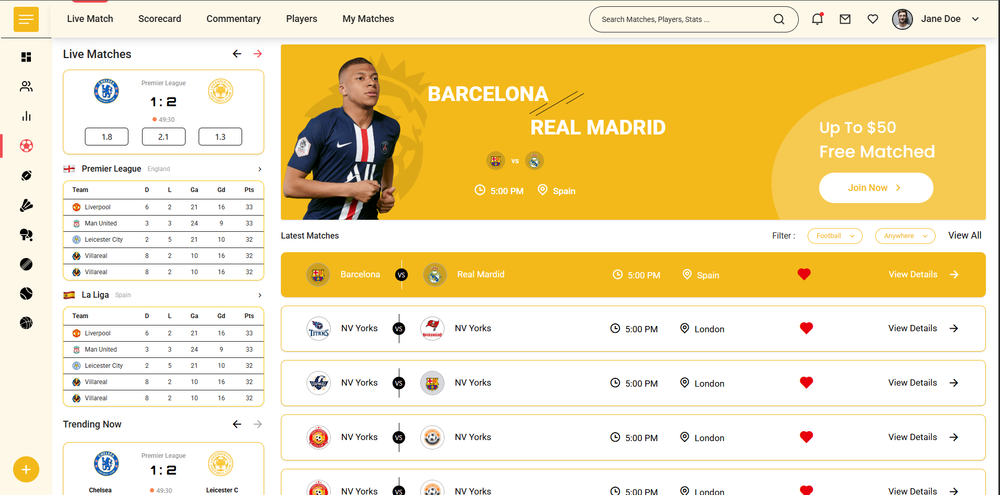

# Frontend Test Task 🚀

## 📌 Overview

This project was developed as part of the **Front-End Developer assignment** from **Digital Prospects Consulting**.

The objective was to implement a responsive and visually accurate UI based on the provided Figma design using modern frontend technologies.

---

## 🎯 Task Requirements

- Create an open-source GitHub project
- Use React.js or Next.js
- Follow the given Figma design as closely as possible
- Submit the project link after completion

---


## 🔗 GitHub Repository

👉 https://github.com/shivsinghcse/Live-matches-assignment

---

## 🚀 Live Demo
**Netlify:** [https://livematchfrontendtask.netlify.app/](https://livematchfrontendtask.netlify.app/)

---

### 📸 Preview


---

## 🛠️ Tech Stack

- React.js
- Tailwind CSS
- JavaScript (ES6+)
- Vite

---

## 🎨 Design Reference

Figma Design Link:  
https://www.figma.com/design/u5vVlLhO7QmBVmEtuH1FfY/Frontend-Test-Task

---

## ✨ Features

- Pixel-perfect UI implementation
- Reusable and modular components
- Clean and scalable code structure
- Organized folder architecture

---

## 📁 Folder Structure

## 📁 Folder Structure

```
.
├── public
│   └── images
├── src
│   ├── assets
│   ├── components
│   │   ├── HeroBanner.jsx
│   │   ├── LatestMatches.jsx
│   │   ├── LeagueTable.jsx
│   │   ├── LeftPanel.jsx
│   │   ├── LiveMatchCard.jsx
│   │   ├── Main.jsx
│   │   ├── Matchrow.jsx
│   │   ├── Navbar.jsx
│   │   ├── RightPanel.jsx
│   │   ├── Sidebar.jsx
│   │   └── TrendingCard.jsx
│   ├── icons
│   │   ├── BasketBall.jsx
│   │   ├── ChartIcon.jsx
│   │   ├── CricketBall.jsx
│   │   ├── DashboardIcon.jsx
│   │   ├── EditIcon.jsx
│   │   ├── GlobeIcon.jsx
│   │   ├── MenuIcon.jsx
│   │   ├── PingPong.jsx
│   │   ├── Shuttlecock.jsx
│   │   ├── TennisBall.jsx
│   │   ├── UserIcon.jsx
│   │   └── index.js
│   ├── utils
│   │   └── matchData.js
│   ├── App.jsx
│   ├── index.css
│   └── main.jsx
├── index.html
├── package.json
├── vite.config.js
├── eslint.config.js
└── README.md
```

---

## 💻 Installation & Setup

Follow these steps to run the project locally:

### 1️⃣ Clone the repository

```bash
git clonehttps://github.com/shivsinghcse/Live-matches-assignment.git
```

### 2️⃣ Navigate to the project folder
```
cd your-repo-name
```

### 3️⃣ Install dependencies
```
npm install
```

### 4️⃣ Run the development server
```
npm run dev
```